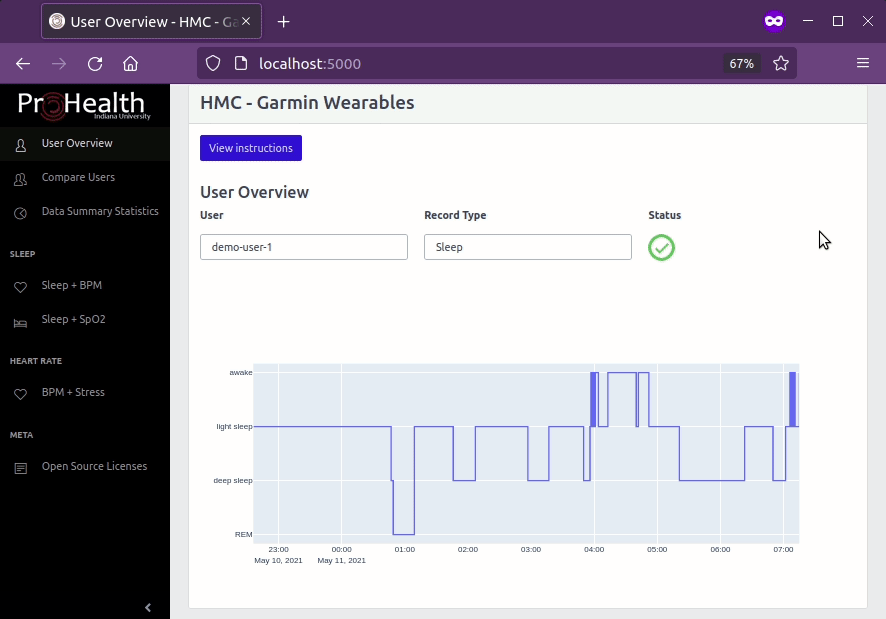

<h1 align="center">A Dashboard (for the Hoosier Moms Cohort)</h1>

<p align="center">
  <i>Some visualizations for exploring data exported from wearable devices.</i>
</p>

<p align="center">
  </img>
</p>

---

*Data is not stored here, this will behave strangely without data.*

**Basic startup**:

```bash
pip install -r requirements.txt
python -m hmcdashboard
# localhost:5000
```

## Architecture

Currently this assumes data for each user is exported from the main
database into a series of `.csv` files.

- Caching into flat files makes later loading *slightly* faster over sqlite
  and doesn't have the overhead of maintaining the sqlite paging, etc.
- Since the main aim here is *visualization* rather than *analysis*,
  we can cut the size of the cached files in half (6GB → 3GB) but produce
  identical visualizations (some notes on doing this are in my
  dev log in the `docs/` directory, and use the `cleanup.py` script).

So first-time-setup will require building a copy of the metadata
from the `data/` directory:

```console
$ ls data
blood_oxygenation  heart_rate  sleep  stress
$ python build_user_table.py
Building sleep
100%|███████████████████████████████████████| 308/308 [00:00<00:00, 4146.80it/s]
Building heart_rate
100%|█████████████████████████████████████████| 354/354 [00:08<00:00, 40.28it/s]
Building blood_oxygenation
100%|███████████████████████████████████████████| 81/81 [00:00<00:00, 89.98it/s]
Building stress
100%|█████████████████████████████████████████| 359/359 [00:13<00:00, 27.20it/s]
Writing to user_metadata.csv
```

## Licenses

This app can be redistributed under the terms of the MIT License.

- **Backend**: `Flask`, `Pandas`
- **Plotting**: `plotly.js`, `plotly.py`
- **Frontend**: `jQuery`, `CoreUI UI Kit`, `CoreUI Bootstrap Admin Template`, `CoreUI Linear Icons`

I learned a trick for switching out plotly visualizations between the front and back
from the Hepta Analytics blog post by Yvonne Wambui (https://blog.heptanalytics.com/flask-plotly-dashboard/),
which is adapted under the terms of the MIT License.

<details>
<summary>View all licensing information</summary>

### HMCDashboard

This dashboard is released under the terms of the MIT License. See the
LICENSE file for details.

<details>
<summary>View License</summary>

```
MIT License

Copyright (c) 2022 Alexander L. Hayes

Permission is hereby granted, free of charge, to any person obtaining a copy
of this software and associated documentation files (the "Software"), to deal
in the Software without restriction, including without limitation the rights
to use, copy, modify, merge, publish, distribute, sublicense, and/or sell
copies of the Software, and to permit persons to whom the Software is
furnished to do so, subject to the following conditions:

The above copyright notice and this permission notice shall be included in all
copies or substantial portions of the Software.

THE SOFTWARE IS PROVIDED "AS IS", WITHOUT WARRANTY OF ANY KIND, EXPRESS OR
IMPLIED, INCLUDING BUT NOT LIMITED TO THE WARRANTIES OF MERCHANTABILITY,
FITNESS FOR A PARTICULAR PURPOSE AND NONINFRINGEMENT. IN NO EVENT SHALL THE
AUTHORS OR COPYRIGHT HOLDERS BE LIABLE FOR ANY CLAIM, DAMAGES OR OTHER
LIABILITY, WHETHER IN AN ACTION OF CONTRACT, TORT OR OTHERWISE, ARISING FROM,
OUT OF OR IN CONNECTION WITH THE SOFTWARE OR THE USE OR OTHER DEALINGS IN THE
SOFTWARE.
```

</details>

---

### Flask: Used under the terms of the BSD-3-Clause License

https://github.com/pallets/flask

<details>
<summary>View License</summary>

```
Copyright 2010 Pallets

Redistribution and use in source and binary forms, with or without
modification, are permitted provided that the following conditions are
met:

1.  Redistributions of source code must retain the above copyright
    notice, this list of conditions and the following disclaimer.

2.  Redistributions in binary form must reproduce the above copyright
    notice, this list of conditions and the following disclaimer in the
    documentation and/or other materials provided with the distribution.

3.  Neither the name of the copyright holder nor the names of its
    contributors may be used to endorse or promote products derived from
    this software without specific prior written permission.

THIS SOFTWARE IS PROVIDED BY THE COPYRIGHT HOLDERS AND CONTRIBUTORS
"AS IS" AND ANY EXPRESS OR IMPLIED WARRANTIES, INCLUDING, BUT NOT
LIMITED TO, THE IMPLIED WARRANTIES OF MERCHANTABILITY AND FITNESS FOR A
PARTICULAR PURPOSE ARE DISCLAIMED. IN NO EVENT SHALL THE COPYRIGHT
HOLDER OR CONTRIBUTORS BE LIABLE FOR ANY DIRECT, INDIRECT, INCIDENTAL,
SPECIAL, EXEMPLARY, OR CONSEQUENTIAL DAMAGES (INCLUDING, BUT NOT LIMITED
TO, PROCUREMENT OF SUBSTITUTE GOODS OR SERVICES; LOSS OF USE, DATA, OR
PROFITS; OR BUSINESS INTERRUPTION) HOWEVER CAUSED AND ON ANY THEORY OF
LIABILITY, WHETHER IN CONTRACT, STRICT LIABILITY, OR TORT (INCLUDING
NEGLIGENCE OR OTHERWISE) ARISING IN ANY WAY OUT OF THE USE OF THIS
SOFTWARE, EVEN IF ADVISED OF THE POSSIBILITY OF SUCH DAMAGE.
```

</details>

---

### Pandas: Used under the terms of the BSD-3-Clause License

https://github.com/pandas-dev/pandas

<details>
<summary>View License</summary>

```
BSD 3-Clause License

Copyright (c) 2008-2011, AQR Capital Management, LLC, Lambda Foundry, Inc. and PyData Development Team
All rights reserved.

Copyright (c) 2011-2022, Open source contributors.

Redistribution and use in source and binary forms, with or without
modification, are permitted provided that the following conditions are met:

* Redistributions of source code must retain the above copyright notice, this
  list of conditions and the following disclaimer.

* Redistributions in binary form must reproduce the above copyright notice,
  this list of conditions and the following disclaimer in the documentation
  and/or other materials provided with the distribution.

* Neither the name of the copyright holder nor the names of its
  contributors may be used to endorse or promote products derived from
  this software without specific prior written permission.

THIS SOFTWARE IS PROVIDED BY THE COPYRIGHT HOLDERS AND CONTRIBUTORS "AS IS"
AND ANY EXPRESS OR IMPLIED WARRANTIES, INCLUDING, BUT NOT LIMITED TO, THE
IMPLIED WARRANTIES OF MERCHANTABILITY AND FITNESS FOR A PARTICULAR PURPOSE ARE
DISCLAIMED. IN NO EVENT SHALL THE COPYRIGHT HOLDER OR CONTRIBUTORS BE LIABLE
FOR ANY DIRECT, INDIRECT, INCIDENTAL, SPECIAL, EXEMPLARY, OR CONSEQUENTIAL
DAMAGES (INCLUDING, BUT NOT LIMITED TO, PROCUREMENT OF SUBSTITUTE GOODS OR
SERVICES; LOSS OF USE, DATA, OR PROFITS; OR BUSINESS INTERRUPTION) HOWEVER
CAUSED AND ON ANY THEORY OF LIABILITY, WHETHER IN CONTRACT, STRICT LIABILITY,
OR TORT (INCLUDING NEGLIGENCE OR OTHERWISE) ARISING IN ANY WAY OUT OF THE USE
OF THIS SOFTWARE, EVEN IF ADVISED OF THE POSSIBILITY OF SUCH DAMAGE.
```

</details>

---

### plotly.js: Used under the terms of the MIT License

https://github.com/plotly/plotly.js

<details>
<summary>View License</summary>

```
The MIT License (MIT)

Copyright (c) 2021 Plotly, Inc

Permission is hereby granted, free of charge, to any person obtaining a copy
of this software and associated documentation files (the "Software"), to deal
in the Software without restriction, including without limitation the rights
to use, copy, modify, merge, publish, distribute, sublicense, and/or sell
copies of the Software, and to permit persons to whom the Software is
furnished to do so, subject to the following conditions:

The above copyright notice and this permission notice shall be included in
all copies or substantial portions of the Software.

THE SOFTWARE IS PROVIDED "AS IS", WITHOUT WARRANTY OF ANY KIND, EXPRESS OR
IMPLIED, INCLUDING BUT NOT LIMITED TO THE WARRANTIES OF MERCHANTABILITY,
FITNESS FOR A PARTICULAR PURPOSE AND NONINFRINGEMENT. IN NO EVENT SHALL THE
AUTHORS OR COPYRIGHT HOLDERS BE LIABLE FOR ANY CLAIM, DAMAGES OR OTHER
LIABILITY, WHETHER IN AN ACTION OF CONTRACT, TORT OR OTHERWISE, ARISING FROM,
OUT OF OR IN CONNECTION WITH THE SOFTWARE OR THE USE OR OTHER DEALINGS IN
THE SOFTWARE.
```

</details>

---

### plotly.py: Used under the terms of the MIT License

https://github.com/plotly/plotly.py

<details>
<summary>View License</summary>

```
The MIT License (MIT)

Copyright (c) 2016-2018 Plotly, Inc

Permission is hereby granted, free of charge, to any person obtaining a copy
of this software and associated documentation files (the "Software"), to deal
in the Software without restriction, including without limitation the rights
to use, copy, modify, merge, publish, distribute, sublicense, and/or sell
copies of the Software, and to permit persons to whom the Software is
furnished to do so, subject to the following conditions:

The above copyright notice and this permission notice shall be included in
all copies or substantial portions of the Software.

THE SOFTWARE IS PROVIDED "AS IS", WITHOUT WARRANTY OF ANY KIND, EXPRESS OR
IMPLIED, INCLUDING BUT NOT LIMITED TO THE WARRANTIES OF MERCHANTABILITY,
FITNESS FOR A PARTICULAR PURPOSE AND NONINFRINGEMENT. IN NO EVENT SHALL THE
AUTHORS OR COPYRIGHT HOLDERS BE LIABLE FOR ANY CLAIM, DAMAGES OR OTHER
LIABILITY, WHETHER IN AN ACTION OF CONTRACT, TORT OR OTHERWISE, ARISING FROM,
OUT OF OR IN CONNECTION WITH THE SOFTWARE OR THE USE OR OTHER DEALINGS IN
THE SOFTWARE.
```

</details>

---


### jQuery JavaScript Library: Used under the terms of the MIT License

https://github.com/jquery/jquery

<details>
<summary>View License</summary>

```
Copyright OpenJS Foundation and other contributors, https://openjsf.org/

Permission is hereby granted, free of charge, to any person obtaining
a copy of this software and associated documentation files (the
"Software"), to deal in the Software without restriction, including
without limitation the rights to use, copy, modify, merge, publish,
distribute, sublicense, and/or sell copies of the Software, and to
permit persons to whom the Software is furnished to do so, subject to
the following conditions:

The above copyright notice and this permission notice shall be
included in all copies or substantial portions of the Software.

THE SOFTWARE IS PROVIDED "AS IS", WITHOUT WARRANTY OF ANY KIND,
EXPRESS OR IMPLIED, INCLUDING BUT NOT LIMITED TO THE WARRANTIES OF
MERCHANTABILITY, FITNESS FOR A PARTICULAR PURPOSE AND
NONINFRINGEMENT. IN NO EVENT SHALL THE AUTHORS OR COPYRIGHT HOLDERS BE
LIABLE FOR ANY CLAIM, DAMAGES OR OTHER LIABILITY, WHETHER IN AN ACTION
OF CONTRACT, TORT OR OTHERWISE, ARISING FROM, OUT OF OR IN CONNECTION
WITH THE SOFTWARE OR THE USE OR OTHER DEALINGS IN THE SOFTWARE.
```

</details>

---

### CoreUI UI Kit and Bootstrap 5: Used under the terms of the MIT License

https://github.com/coreui/coreui

<details>
<summary>View License</summary>

```
The MIT License (MIT)

Copyright (c) 2011-2021 Twitter, Inc.
Copyright (c) 2011-2021 The Bootstrap Authors

Permission is hereby granted, free of charge, to any person obtaining a copy
of this software and associated documentation files (the "Software"), to deal
in the Software without restriction, including without limitation the rights
to use, copy, modify, merge, publish, distribute, sublicense, and/or sell
copies of the Software, and to permit persons to whom the Software is
furnished to do so, subject to the following conditions:

The above copyright notice and this permission notice shall be included in
all copies or substantial portions of the Software.

THE SOFTWARE IS PROVIDED "AS IS", WITHOUT WARRANTY OF ANY KIND, EXPRESS OR
IMPLIED, INCLUDING BUT NOT LIMITED TO THE WARRANTIES OF MERCHANTABILITY,
FITNESS FOR A PARTICULAR PURPOSE AND NONINFRINGEMENT. IN NO EVENT SHALL THE
AUTHORS OR COPYRIGHT HOLDERS BE LIABLE FOR ANY CLAIM, DAMAGES OR OTHER
LIABILITY, WHETHER IN AN ACTION OF CONTRACT, TORT OR OTHERWISE, ARISING FROM,
OUT OF OR IN CONNECTION WITH THE SOFTWARE OR THE USE OR OTHER DEALINGS IN
THE SOFTWARE.
```

</details>

---

### CoreUI "Free" Bootstrap Admin Template: Used under the terms of the MIT License

https://github.com/coreui/coreui-free-bootstrap-admin-template

<details>
<summary>View License</summary>

```
The MIT License (MIT)

Copyright (c) 2018 creativeLabs Łukasz Holeczek.

Permission is hereby granted, free of charge, to any person obtaining a copy
of this software and associated documentation files (the "Software"), to deal
in the Software without restriction, including without limitation the rights
to use, copy, modify, merge, publish, distribute, sublicense, and/or sell
copies of the Software, and to permit persons to whom the Software is
furnished to do so, subject to the following conditions:

The above copyright notice and this permission notice shall be included in
all copies or substantial portions of the Software.

THE SOFTWARE IS PROVIDED "AS IS", WITHOUT WARRANTY OF ANY KIND, EXPRESS OR
IMPLIED, INCLUDING BUT NOT LIMITED TO THE WARRANTIES OF MERCHANTABILITY,
FITNESS FOR A PARTICULAR PURPOSE AND NONINFRINGEMENT. IN NO EVENT SHALL THE
AUTHORS OR COPYRIGHT HOLDERS BE LIABLE FOR ANY CLAIM, DAMAGES OR OTHER
LIABILITY, WHETHER IN AN ACTION OF CONTRACT, TORT OR OTHERWISE, ARISING FROM,
OUT OF OR IN CONNECTION WITH THE SOFTWARE OR THE USE OR OTHER DEALINGS IN
THE SOFTWARE.
```

</details>

---

### CoreUI "Linear" Icons: Used under the terms of the "CoreUI Icons Free License"

https://github.com/coreui/coreui-icons

<details>
<summary>View License</summary>

```
CoreUI Icons Free is free, open source, and GPL friendly. You can use it for
commercial projects, open source projects, or really almost whatever you want.
Full CoreUI Icons Free license: https://coreui.io/icons/license/.

Icons: CC BY 4.0 License (https://creativecommons.org/licenses/by/4.0/)
In the CoreUI Icons Free download, the CC BY 4.0 license applies to all icons
packaged as SVG and JS file types.

Fonts: SIL OFL 1.1 License (https://scripts.sil.org/OFL)
In the CoreUI Icons Free download, the SIL OLF license applies to all icons
packaged as web and desktop font files.

Code: MIT License (https://opensource.org/licenses/MIT)
In the CoreUI Icons Free download, the MIT license applies to all non-font and
non-icon files.

Attribution is required by MIT, SIL OLF, and CC BY licenses. Downloaded
CoreUI Icons Free files already contain embedded comments with sufficient
attribution, so you shouldn't need to do anything additional when using
these files normally.

We've kept attribution comments terse, so we ask that you do not actively work
to remove them from files, especially code. They're a great way for folks to
learn about CoreUI Icons.
```

</details>

</details>
